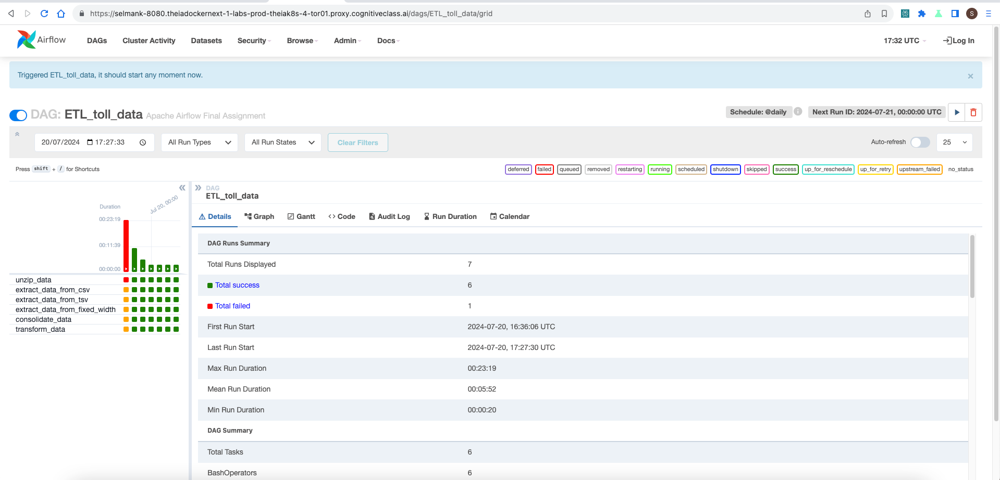
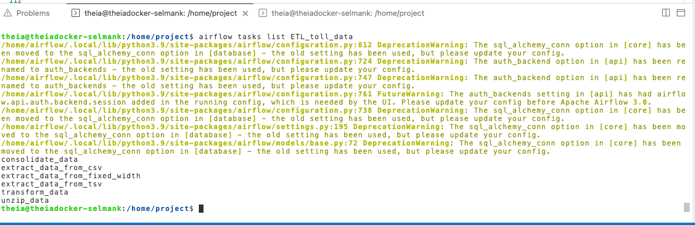
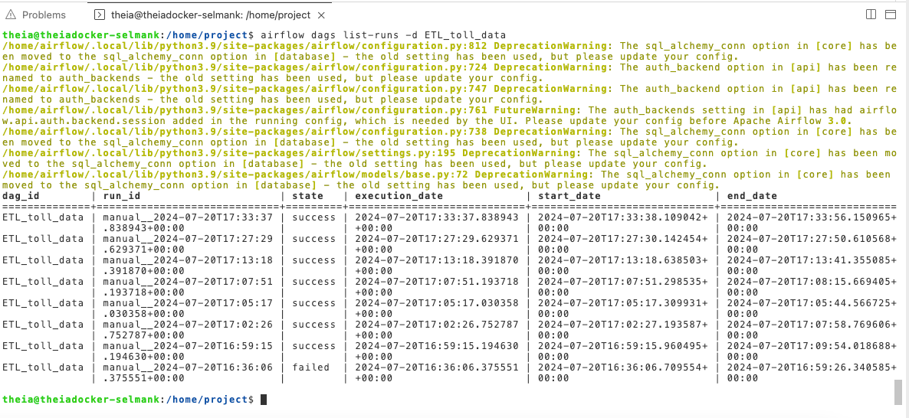
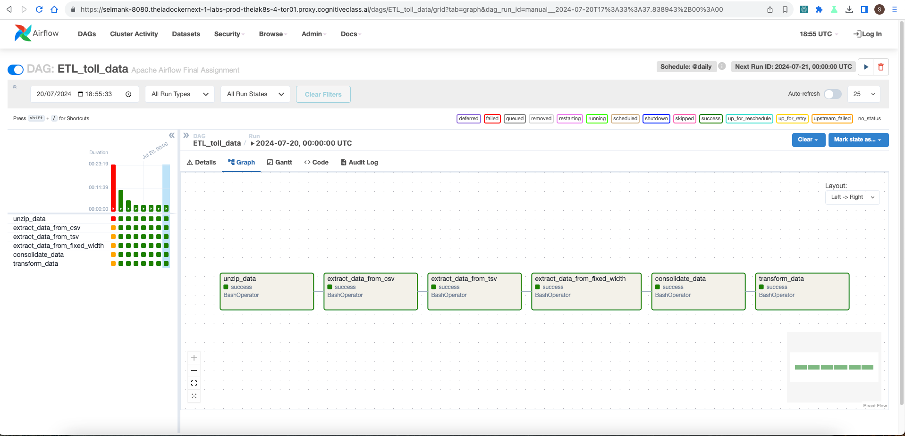

By Selman Karaosmanoglu 

## Date created

20 July 2024

# ETL Pipeline with Apache Airflow

This repository contains an ETL (Extract, Transform, Load) pipeline project designed to decongest national highways by analyzing road traffic data from various toll plazas. Each highway is managed by a different toll operator, and their IT systems use different file formats. This project consolidates this disparate data into a single file for analysis.

## Project Overview

The goal of this project is to develop an Apache Airflow DAG that performs the following tasks:

1. **Extract data** from:
   - CSV files
   - TSV files
   - Fixed-width files
2. **Transform the data** to a common format.
3. **Load the transformed data** into a staging area for further analysis.

## Architecture


## Getting Started

### Prerequisites

- Python 3.10+
- Apache Airflow 2.9+

### Tasks

### Create imports, DAG argument and definition

#### Task 1.1: Define DAG arguments 

```python
default_args = {
    "owner": "selmank",
    "start_date": datetime.today(),
    "email": "info@apache.org",
    "email_on_failure": True,
    "email_on_retry": True,
    "retries": 1,
    "retry_delay": timedelta(minutes=5),
}
```

#### Task 1.2: Define the DAG 
```python
dag = DAG(
    "ETL_toll_data",  # DAG id
    default_args=default_args,  # Use the default_args defined above
    description="Apache Airflow Final Assignment",  # Description of the DAG
    schedule_interval="@daily",  # Schedule the DAG to run once daily
    catchup=False,  # If False, DAG will not backfill runs before the start_date
)
```

### Create the tasks using pythonOperator

Task 2.1: Unzip data. 
```python
# tar -xzvf tolldata.tgz -C /tolldata
unzip_data = BashOperator(
    task_id="unzip_data",
    bash_command="tar -xvf /home/project/airflow/dags/finalassignment/tolldata.tgz -C /home/project/airflow/dags/finalassignment",
    dag=dag,
)
```

Task 2.2: Create a task to extract data from csv file 
```python
extract_data_from_csv = BashOperator(
    task_id="extract_data_from_csv",
    bash_command=(
        "cut -d',' -f1,2,3,4 /home/project/airflow/dags/finalassignment/vehicle-data.csv > "
        "/home/project/airflow/dags/finalassignment/csv_data.csv"
    ),
    dag=dag,
)
```

Task 2.3: Extract data from tsv file 
```python
# cut -f5,6,7 tollplaza-data.tsv | sed 's/\t/,/g' | tr -d '\r' > tsv_data.csv
# tr -d removes a character from file \r gives error in paste command thus deleted.
# od -c -> command that display file contents, -c means characters or backlslash escapes
extract_data_from_tsv = BashOperator(
    task_id="extract_data_from_tsv",
    bash_command=(
        "cut -f5,6,7 /home/project/airflow/dags/finalassignment/tollplaza-data.tsv | "
        "sed 's/\\t/,/g' |"
        "tr -d '\\r' > /home/project/airflow/dags/finalassignment/tsv_data.csv"
    ),
    dag=dag,
)
```

Task 2.4: Extract data from fixed width file 
```python
# Extract the fields Type of Payment code, and Vehicle Code
# cut -c 59-67 payment-data.txt > fixed_width_data.csv | tr " " "," > fixed_width_data.csv
extract_data_from_fixed_width = BashOperator(
    task_id="extract_data_from_fixed_width",
    bash_command=(
        "cut -c 59-67 /home/project/airflow/dags/finalassignment/payment-data.txt | "
        "sed 's/ /,/g' > /home/project/airflow/dags/finalassignment/fixed_width_data.csv"
    ),
    dag=dag,
)
```

Task 2.5: Create a task to consolidate data extracted from previous tasks 
```python
# paste -d',' csv_data.csv tsv_data.csv fixed_width_data.csv > extracted_data2.csv
consolidate_data = BashOperator(
    task_id="consolidate_data",
    bash_command=(
        "paste -d',' /home/project/airflow/dags/finalassignment/csv_data.csv "
        "/home/project/airflow/dags/finalassignment/tsv_data.csv "
        "/home/project/airflow/dags/finalassignment/fixed_width_data.csv > "
        "/home/project/airflow/dags/finalassignment/extracted_data.csv"
    ),
    dag=dag,
)

```

Task 2.6: Transform the data 
```python
# awk -F',' 'NR==1{print; next} {print $1 "," $2 "," $3 "," toupper($4) "," $5 "," $6 "," $7 "," $8 "," $9}' extracted_data.csv > transformed_data.csv
transform_data = BashOperator(
    task_id="transform_data",
    bash_command="""\
        awk -F',' '
        NR==1 {
            print;
            next
        }
        {
            print $1 "," $2 "," $3 "," toupper($4) "," $5 "," $6 "," $7 "," $8 "," $9
        }
        ' /home/project/airflow/dags/finalassignment/extracted_data.csv \
        > /home/project/airflow/dags/finalassignment/transformed_data.csv
    """,
    dag=dag,
)
```

Task 2.7: Define the task pipeline 
```python
(
    unzip_data
    >> extract_data_from_csv
    >> extract_data_from_tsv
    >> extract_data_from_fixed_width
    >> consolidate_data
    >> transform_data
)

```

### Getting the DAG operational

#### Task 3.1: Submit the DAG 

Put ETL_toll_data.py file into `airflow/dags` folder

#### Task 3.2: Unpause and trigger the DAG 



#### Task 3.3: List the DAG tasks 

```bash
airflow tasks list ETL_toll_data
```



#### Task 3.4: Monitor the DAG

```bash
airflow dags list-runs -d ETL_toll_data
```





## Contributing

Contributions are welcome! Please open an issue or submit a pull request for any improvements or bug fixes.

## License

This project is licensed under the MIT License. See the [LICENSE](LICENSE) file for details.